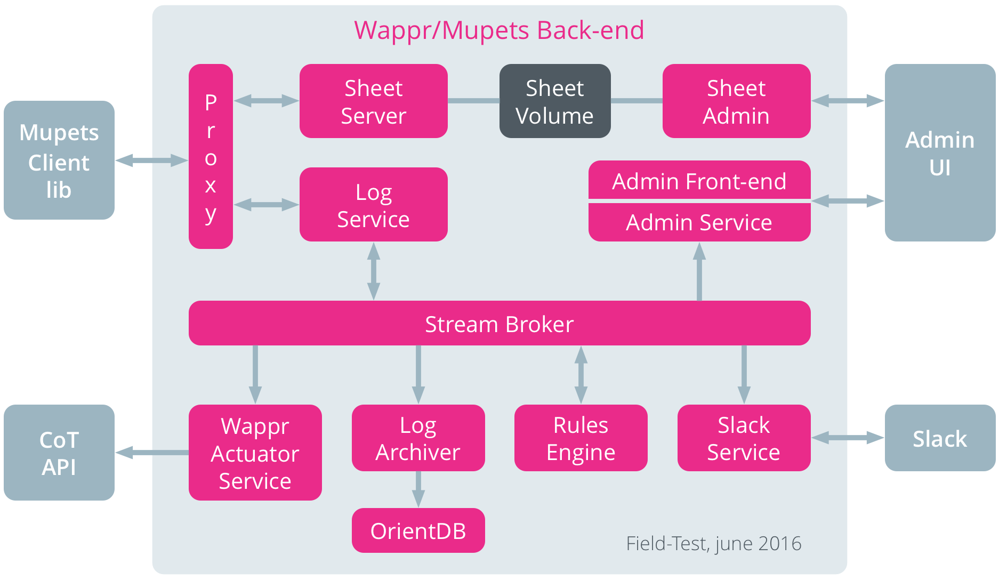
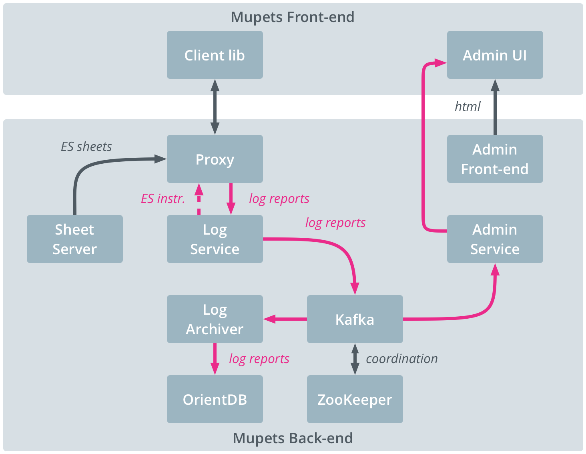

# Mupets Server Architecture

## Default Architecture

The _Mupets_ back-end is based on (an early version of) __Duxis/Soyl__, a modular software framework for __Data-Driven Living Labs__. To support modularity and scalability, the Duxis back-end is composed of a set of micro-services implemented as [Docker][] containers, each of which implements a specific functionality. The _Mupets_ back-end is composed of the following micro-services:

1. [__Admin__](../../images/admin/README.md) – An _Cargo_-container that serves the [admin web-interface](../user/admin.md) and supporting API's.

2. [__Log-Archiver__](../../images/log-archiver/README.md) – A _Cargo_-container that subscribes to the log report stream and stores the reports in a database on the OrientDB server.

3. [__Log-Service__](../../images/log-service/README.md) – A _Cargo_-container that runs the [Activity Logging Service](../user/activity-logging.md) and publishes the log reports it receives on the stream broker.

4. [__Orientdb__](../../images/orientdb/README.md) – Runs an [OrientDB][] server in which the activity logs and the rule-match events are archived.

5. [__Proxy__](../../images/proxy/README.md) - Reverse proxy ([Traefik][]) for the front-end and api's provided by the micro-services.

6. [__Redis-Broker__](../../images/redis-broker/README.md) – Runs [Redis][] as publish/subscribe stream broker, the beating heart of the Mupets back-end.

7. [__Rules-Engine__](../../images/rules-engine/README.md) - A _Cargo_-container that provides a basic (naive) rules engine.

8. [__Sheet-Admin__](../../images/sheet-admin/README.md) - A _Cargo_-container that provides the engine and API for editing and generating the ESM sheets.

9. [__Sheet-Server__](../../images/sheet-server/README.md) - Runs [Nginx][] that serves the ESM sheets.

10. [__Slack-Service__](../../images/slack-service/README.md) - A business container that runs the Mupets [Slack][] bot.

The following diagram shows the different containers in the back-end, the front-end component, and the interactions between them.

## Kafka-based Architecture

This alternative configuration uses [Apache Kafka][] instead of [Redis][] as stream broker.

1. __mupets-kafka__ – This container runs [Apache Kafka][], the core data stream broker.

2. __mupets-zookeeper__ – This container runs [Apache ZooKeeper][], which is needed by the [Apache Kafka][] instance in the previous container.

The current container setup is managed with [Docker Compose][].

----
__[[ Back ](../../README.md)]__

[Apache Kafka]: http://kafka.apache.org
[Apache ZooKeeper]: https://zookeeper.apache.org
[Docker]: https://www.docker.com
[Docker Compose]: https://www.docker.com/products/docker-compose
[OrientDB]: http://orientdb.com
[Nginx]: http://nginx.org
[Node.js]: https://nodejs.org
[Redis]: http://redis.io
[Slack]: https://slack.com
[Traefik]: https://traefik.io