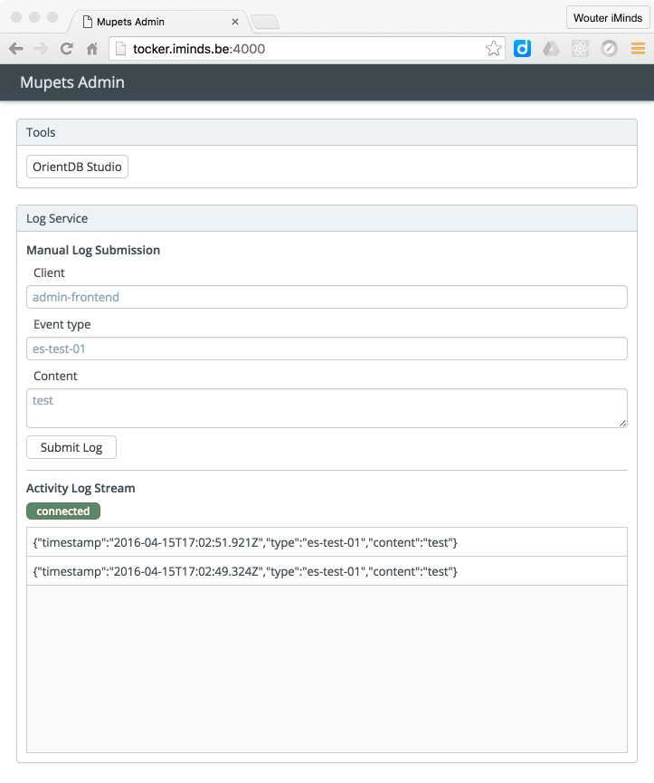

# Mupets Admin

## Mupets Admin-Front-End

The Mupets _Admin-Front-End_ is served by the HTTP server on the base domain, e.g. [mupets.tocker.iminds.be](mupets.tocker.iminds.be) for the staging deployment on _Tocker_, or [mupets.dev](mupets.dev) on your local dev deployment.
The current interface is shown below.

The front-end interface currently provides two panels: _Tools_, which provides a link to the OrientDB Studio, and _Log Service_, which is documented below.

### Log Service panel

#### Manual Log Submission

Here you can report arbitrary log events to the log service.

#### Activity Log Stream

This pane shows a real-time stream of submitted log reports. This stream is obtained from the _Mupets Admin Service_.

## Mupets Admin Service

The _Mupets Admin Service_ is a JSON-service for administrative purposes. It currently only serves the log report stream through a web socket, which is used by the _Admin-Front-End_.

----
__[[ Back ](../../README.md)]__
